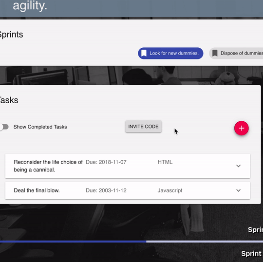
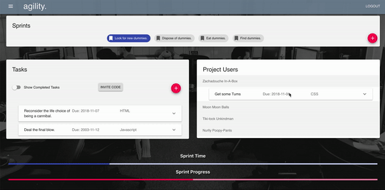

# agility.
agility. is a project management app that tracks the progress of its individual users with the principal intent of promoting accountability and providing the opportunity to ensure innovation for future projects. 

This is done by visualizing not only the successes but also the conflicts as they occur throughout the entirety of a given project. Daunting projects can therefore be effectively analyzed and broken down to allow for a better and overall more streamlined process. The app is specifically designed for project managers, allowing them the ability to assign tasks to project workers and monitor the efficiency of each member assigned a task within a project sprint. Ultimately, we believe this will drive the best collaborative results.

# Deployment 
This app is currently [deployed](https://scrum41.herokuapp.com/)! 

# Features
<b>Login/Register</b>

- Users can register for accounts!
- System prevents users to register with emails of existing users!
- Persistant login! 

<b>Projects</b>

- Users can create projects, which can be populated with sprints! (development cycles)
- Project creators are the admins of all the sprints they create within the project. 

<b>Sprints</b>

- Active sprints have task pools that sprint participants can pull tasks from. 
- Task are classified by the stack (technology) they use and the level of complexity deemed by the project creator. 
- Completed tasks are tracked, and users can see how they measure up in terms of task completion and the difficulty of the tasks they take on.
- Completed sprints will have summary tab that tracks the sprint's general performance as well as how its participants performed.
- Project addresses are encrypted for project confidentiality!
- Users can see how the sprint is doing relative to time with the progress bars at the bottom of the page.
- Past sprints are displayed in a series of chips at the top of the page, with popover handles that show their date range. 
- Only admins can add tasks and create new sprints, as well as unassign/interact with tasks from other users. 

<b>Homepage</b>

- A dropdown profile card that shows User's stats across all the sprints they've ever partipated in. 
- Includes a top 3 stack list that shows their most proficient/attempted tasks involving specific technologies. (i.e. Javascript, HTML, React)
- Active Task Pane, shows upcoming tasks that are due for the user across all sprints.
- Project List Box at the bottom shows all projects that the user is involved in.
- Project List Box has an add project by invite code that accepts a unique hash (generated by specific) project pages and can add invited users. 

<b>Navbar</b>

- Navbar opens a left drawer that shows all the projects the user is involved in a nice tabs. 
- Also has navigation to homepage. 

<b>Misc</b>

- Attempting to navigate to bad addresses, takes users to a 404 page which will promptly send them to their homepage (or landing page if they're not logged in) after 5 seconds.

# Watch the app in action!

<small>Users can see their lifetime stats.</small>

<small>Users can see their stats within sprints of projects.</small>

<small>Live update of sprint progression based on user input!<small>

# Built With

# Made By

